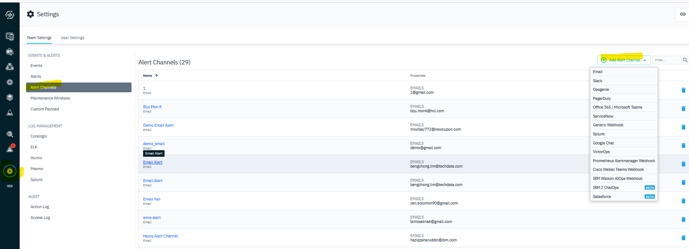
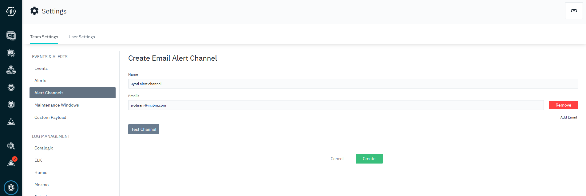
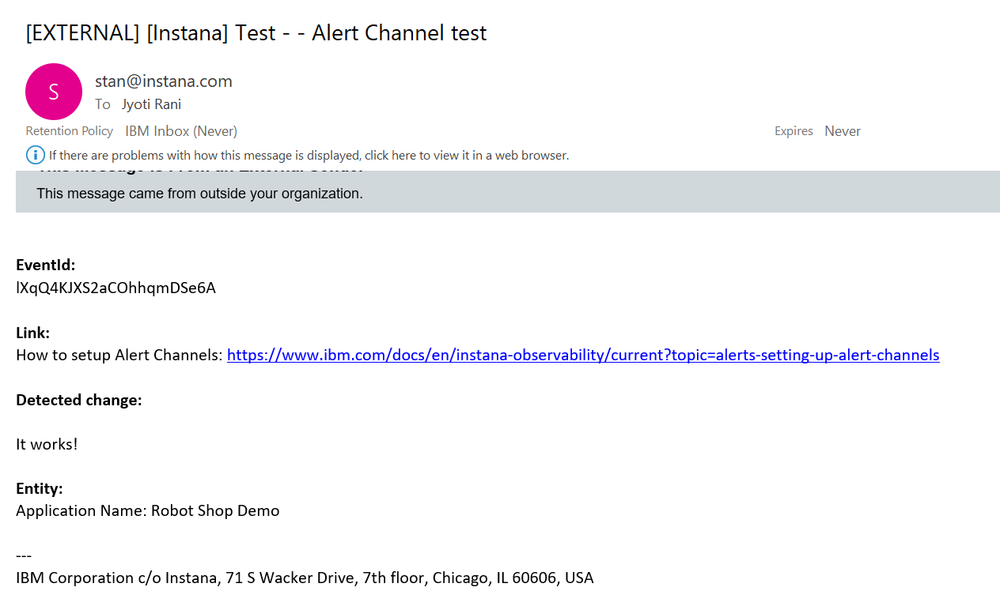
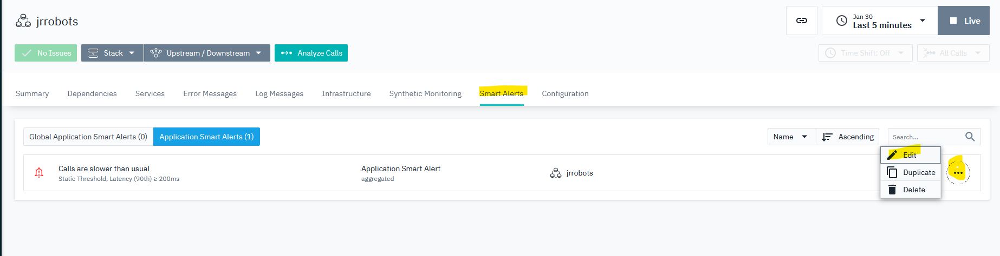
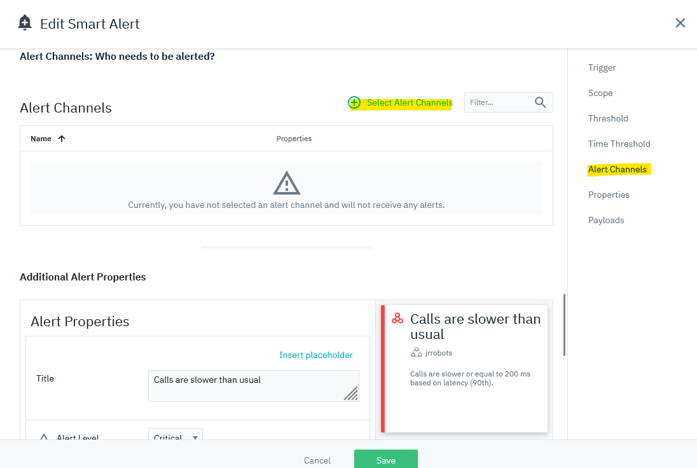
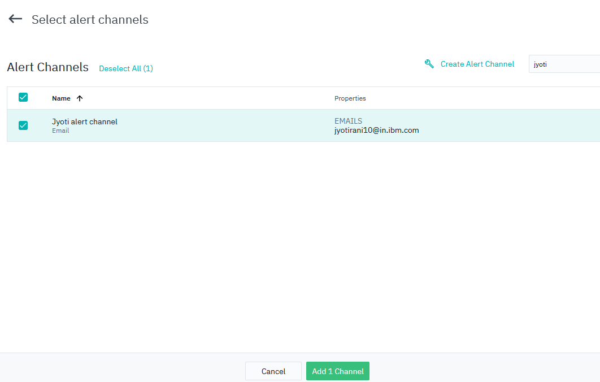
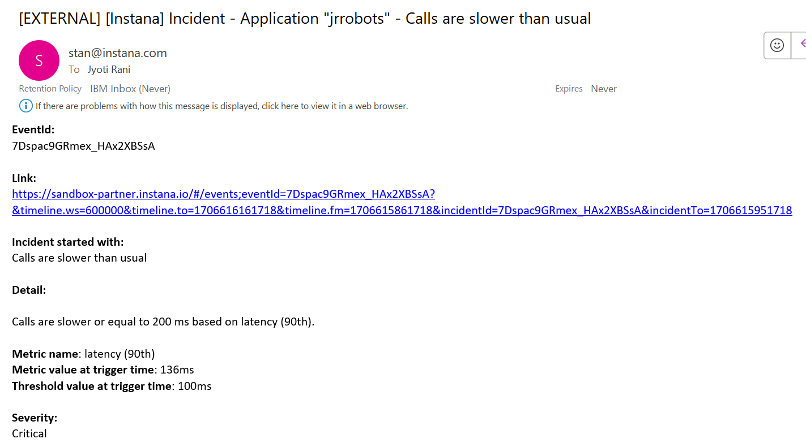

export const Title = () => (
  
    Lab 12 - Alert Channels  
  
);
;

## Lab Overview

In this lab we will understand what alert channels Instana supports, how to create an alert channel and how to define an alert with one or more alert channels.

## Step 1: 

Review the list of Alert channels supported by Instana currently. 

Click "Settings" -> "Alert Channels" -> "Add Alert Channel" 

You can see what alert channels Instana currently supports 

 

## Step 2:

Create an alert channel. Simplest alert channel might be email.

Click "Add Alert Channel" button and select "Email" from the dropdown list.

Enter the name of your alert channel prefixed with "your name alert channel". 
Enter your email for test purpose. We can add as many emails as you want.

 

Click "Test Channel", it will trigger a test email to configured email(s), the content looks like this:

 

## Step 3:

In Lab 11 we already created a smart alert. Lets now trigger an email alert for the same.

Go to the application perspective that you have created for the robot shop application.

Click on the Smart alerts tab.

Click on the three dots next to the Smart alert you created in the previous lab and click "Edit".

 

Click on the Alert channels in the left side menu and then click "Select Alert channels".

 

Search for the alert channel created in Step#2 and click Add channel.

Once the smart alert is triggered, you should receive an email alert for the same as shown below:

 

As you could see from this lab, Instana provides out-of-the-box Alert Channels that can help SRE/operator to stay informed for potential issues and take proactive actions.
