export const Title = () => (
  
    Lab 13 - Custom Dashboards  
  
);
;

## Lab Overview

In this lab we will create custom dashboard from directly within Instana, to cover the needs of building an SLO (service-level objective) oriented dashboard. While Instana provides comprehensive dashboards to support common use-cases, there can be situations where a custom dashboard needs to be created.

There are three options for custom dashboarding with Instana:
1.	Build native custom dashboards from directly within Instana (will be covered in this lab).
2.	Leverage Instana's Grafana plugin when you'd like to combine Instana data with other data sources.
3.	Leverage Instana REST API and build dashboards in the tool of your choice for complete flexibility.

## Step 1: 

Click the Instana icon, it will show the default dashboard. 

Click the dropdown and we can click the "Create Dashboard" button to start:

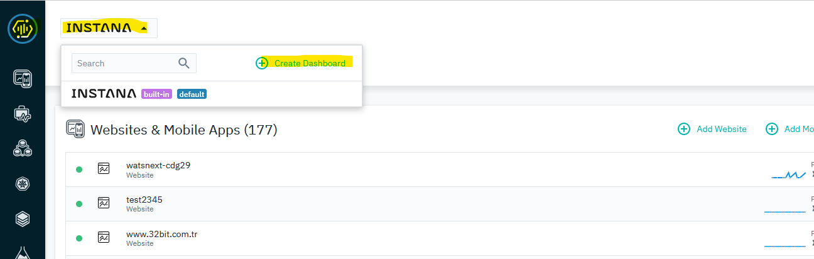 

In the prompt, let’s give it a name say "your name SLO Monitoring", and click "Create":
 
You will be redirected to the newly created dashboard, which is blank now.

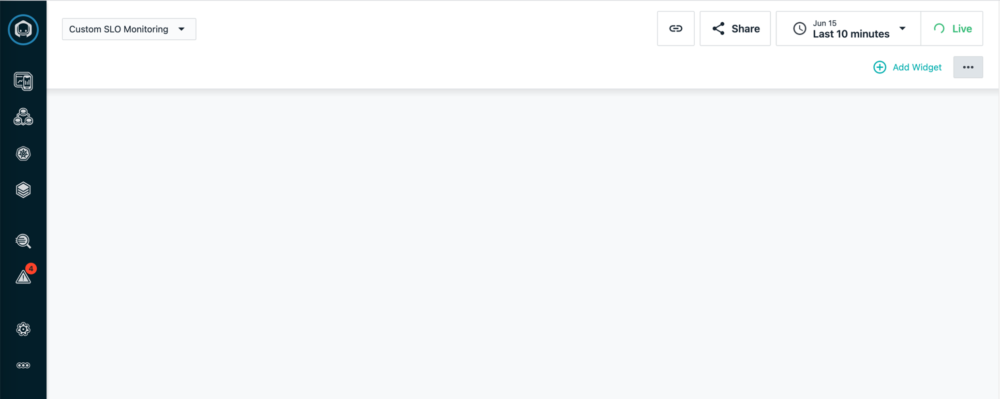 

## Step 2:

Click "Add Widget" to add a new widget to the dashboard. 

There are couple of widget types to choose from, lets select "SLO" widget. 

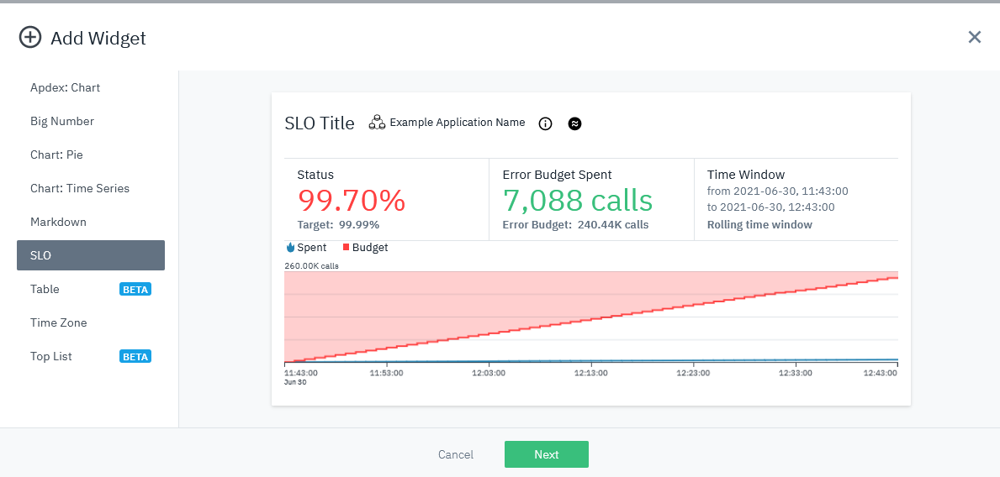 

Click Next.

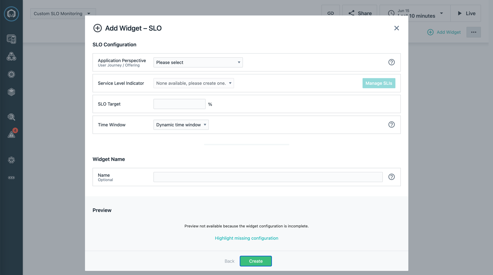 

Select your application perspective from the dropdown.

You may not have a predefined SLI yet, so click "Manage SLIs" button to create one:

Let’s define a "Service Latency" SLI with:
SLI Customization:
-	Name: Service Latency - Catalogue Service
-	Type: Time-based
SLI Entity:
-	Boundary: Inbound Calls
-	Service: catalogue
-	Endpoint: All Endpoints
Metric and Threshold:
-	Metric: Latency
-	Aggregation: 95th
-	Threshold (ms): 200

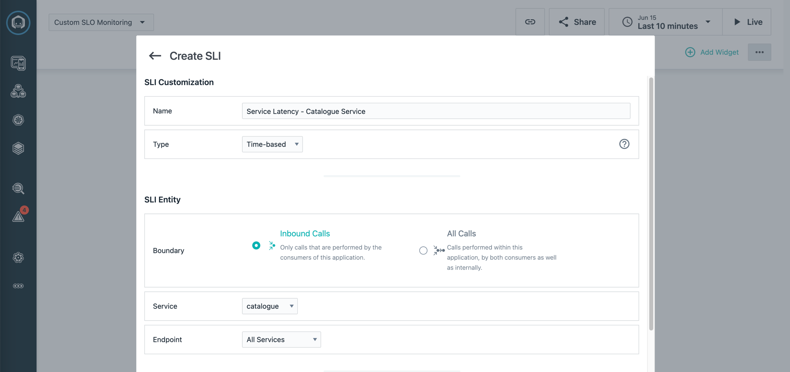 
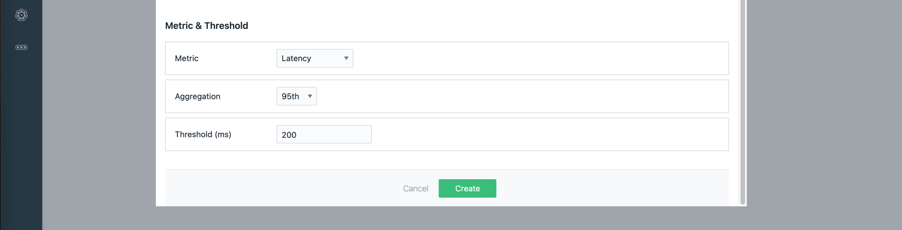 

Click "Create" button to create it and go back to our widget configuration page.

SLO Configuration:
-	Application Perspective: your AP’s name
-	Service Level Indicator: the one you just created, e.g. Service Latency - Catalogue Service
-	SLO Target: 99 %
-	Time Window: Dynamic time window
Widget Name:
-	Name: SLO your name - Catalogue Service

There is a good preview for how the SLO will look like. 

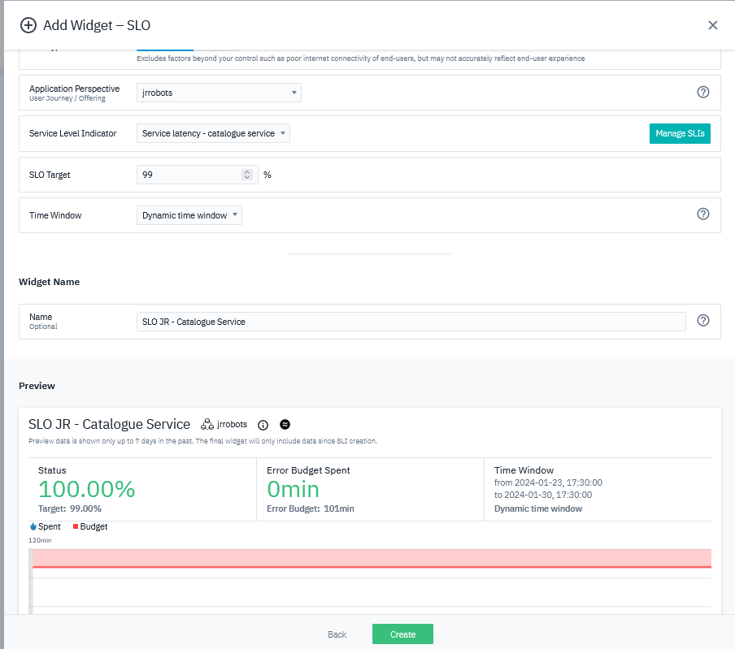 

Click "Create" button to create this SLO widget.

Do remember to click the "Save changes" to save it.

## Step 3:

Lets add another event based widget.

Let’s quickly go through these steps to add an event-based widget:
 
 

Now let’s create the SLI with:
SLI Customization:
-	Name: Event SLI - Your Robot Shop
-	Type: Event-based
SLI Entity:
-	Boundary: Inbound Calls
Good Events:
-	Call Erroneous is false
Bad Events:
-	Call Erroneous is true OR Call Latency >=5000

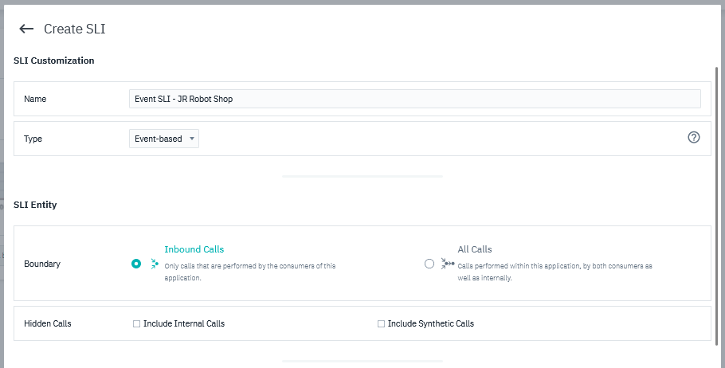 
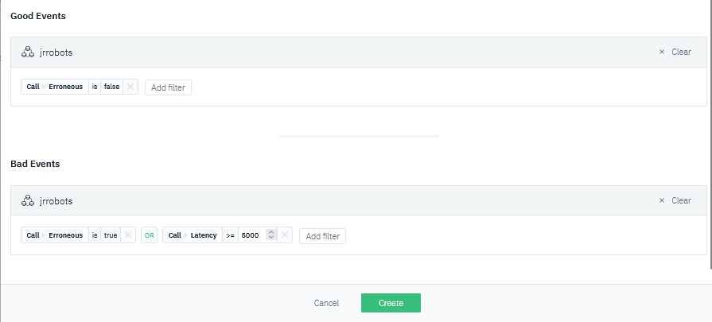 

Click Create and return to the SLO configuration page.

Make sure the newly created SLI is selected in the dropdown.

Let’s configure the widget as below:
SLO Configuration:
-	Application Perspective: your AP’s name
-	Service Level Indicator: the one you just created, e.g. Event SLI - Your Robot Shop
-	SLO Target: 95 %
-	Time Window: Dynamic time window
Widget Name:
-	Name: SLO – Your name Robot Shop Events

 

Click Create button and return to the dashboard view.

Note: you may hover over the widget and some buttons will be appeared, by which we can move, edit, duplicate, delete the widget.

Re-position the widget via dragging as below:

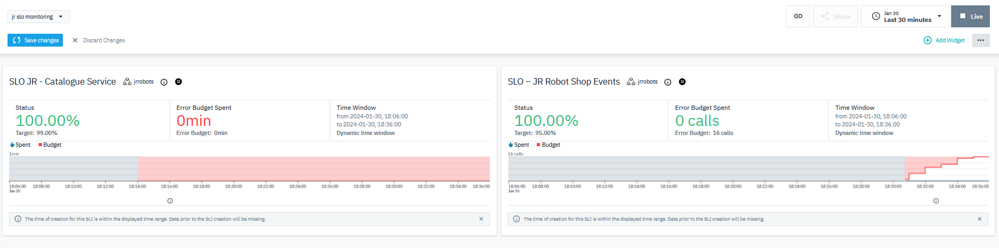 

Click "Save changes".

## Step 4:

Once clicked the "…" button on top right, there are more options:
-	TV Mode: This is to become "full screen" so it’s perfect to project it to TV.
-	Make Default: Make this dashboard as default in the landing page after login. 
-	Edit Name: This is to edit the dashboard name
-	Edit As JSON: This is to edit the dashboard in JSON format – this is cool especially when we’re editing some metric numbers.
-	Duplicate: This is to duplicate the dashboard.
-	Delete: This is to delete the dashboard.

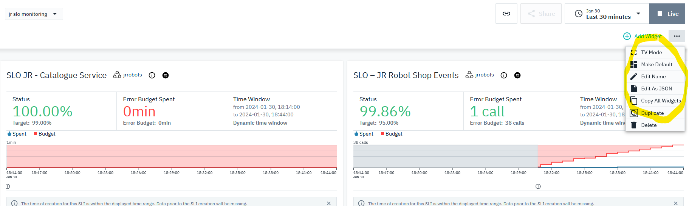 
 
And by default, the custom dashboards are private, which means that only the author can see them. 
We can click the "Share" button to make it public based on the user permissions.

 

 