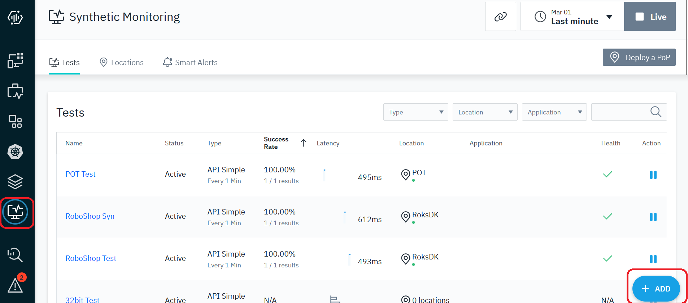
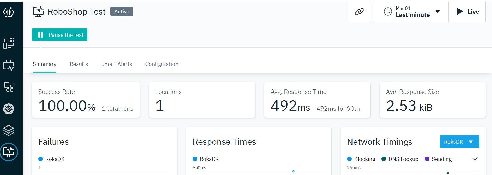

export const Title = () => (
  <span>
    Lab 4 - Synthetic Monitoring <br />
  </span>
);
;

## Lab Overview

Synthetic monitoring is a proactive approach to monitoring the performance and functionality of applications, websites, and APIs. It involves simulating real user interactions and measuring how the system responds. This allows you to identify and fix issues before they impact real users.

This lab focuses on  Instana feature - Synthetic Monitoring. Key capabilities that we will cover:
1. Setting up the synthetic "Point of Presence". This is the component that executes the synthetic test.
2. Test Availability of your website using API Simple Test 

Before we can create any synthetic tests, we must first setup a synthetic "Point of Presence" or "PoP server" to playback our synthetic tests. Many customers deploy two or more "Points of Presence" so that they can compare the response time and availability from different network zones. 

In the lab, we will begin by installing the "Synthetic Point of Presence". 

## Step 1: 

Install Synthetic Point of Presence component

***********************************************************************************************************
## Note: 
If you are using [Instana POT environment](https://ibm.github.io/aiops-pot/docs/category/instana-pot)

We will be installing the Synthetic Point of Presence into  Kubernetes Cluster provided in the POT / Sandbox.
Helm is already installed on `ipot-rsmaster` VM in POT environment, so we will deploy Synthetic Pop on this server. 

If not using POT environment, proceed to step 3.
***********************************************************************************************************

## Step 2:

From the Instana sandbox UI, Click on "Synthetic Monitoring" and then on "Deploy a PoP" button:

 

Use Simple tab for Helm command

 

You will need to edit the information contained in the helm command, so copy and paste the text to a file to edit.

```
Helm install synthetic-pop \
	--repo "https://agents.instana.io/helm" \
	--namespace syn \
	--create-namespace \
	--set downloadKey="xxx" \
	--set controller.location="MyPop;RoksDK;India;Blr;0;0;This is a Synthetic PoP Testing" \
	--set controller.clusterName="cp4i" \
    --set controller.instanaKey="xxx" \
	--set controller.instanaSyntheticEndpoint="https://synthetics-xxx-saas.instana.io" \
	--set redis.tls.enabled=false \
	--set redis.password="a1fc5d01bcbb" \
    --set seccompDefault=true \  
	synthetic-pop
```
The default helm command will look as  above. Some of the parameters have been replaced with "xxx" for security reasons.
For Synthetic Point of Presence we need to modify some of the parameters and provide additional parameter. 

1. Add `--set seccompDefault=true \`. This parameter is required for OpenShift versions 4.11 and above.
2. Then, modify the `controller.clusterName` parameter and provide a meaningful name.
3. In the `controller.location`, specify a name, display name, country, etc. for your "Point of Presence". as shown in example above `MyPop;<student name>;India;Blr;0;0;This is a Synthetic PoP Testing`

Copy the helm command from the text file and paste it into a terminal window on `ipot-rsmaster` VM. This will execute the helm chart.
You should see an output similar to the following:

```
[user@bastion ~]$ helm install synthetic-pop \
>     --repo https://agents.instana.io/helm  \
>     --namespace syn\
>     --create-namespace \
>     --set downloadKey="xxx" \
>     --set controller.location=" MyPop;RoksDK;India;Blr;0;0;This is a Synthetic PoP Testing" \
>     --set controller.instanaKey="xxx" \
>     --set controller.clusterName="cp4i" \
>     --set controller.instanaSyntheticEndpoint=" https://synthetics-xxx-saas.instana.io " \
>     --set redis.tls.enabled=false \
>     --set redis.password="a1fc5d01bcbb" \
>     --set seccompDefault=true \
>     synthetic-pop
NAME: synthetic-pop
LAST DEPLOYED: Thu Jul 13 07:49:37 2023
NAMESPACE: syn
STATUS: deployed
```

Verify Installation 
After the Synthetic point of presence is installed verify its appearance in the Instana UI:

 

You can also confirm that the Synthetic Point of Presence is running by typing:

```
kubectl get pods -n syn  (syn is a namespace) 
```

## Step 3: 
 
Let's begin by executing a simple REST API test. This will be a single GET request.
Begin by selecting Synthetics and then "+ADD" button as seen below.
 

Then, click the Add Synthetic Test button.
 

you will see that you have the option of an API Simple test or an API Script test. Leave the default of API Simple and click the Next button.
 

A new dialog will open prompting for the REST API GET URL. Enter the URL for your robotshop application:
http://x.x.x.x:8080/    
This could be any REST request. In this case, we are testing the  API call for the Robot Shop application.

Then, select your Point of Presence location and click Next. This allows you to choose the location(s) where you want your synthetic script to execute. In the lab, you only have 1 location that you can select. 

 

The next screen allows you to specify the scheduling interval for your synthetic test. Drag the time slider to 1 minute. Then, select Next
 

On the next screen you will give your syntetic test a name and description. Then, optionally, associate the synthetic test with an application. 
Finally, click the Create button to finish creating your synthetic test.
 

On the next Screen , select Tests Tab 
Click on the RoboShop Test  link to drill down into the details of the synthetic test.
It will take a couple of minutes for the synthetic tests to begin executing.

 

On the screen, you can see a summary of the synthetic results. You can also click on the Results tab and see the detailed results of each synthetic test.
 

In this lab, you have now successfully created a synthetic test for a single REST API.

