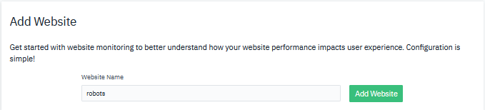
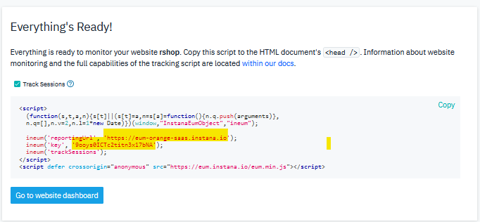
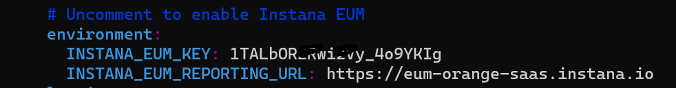
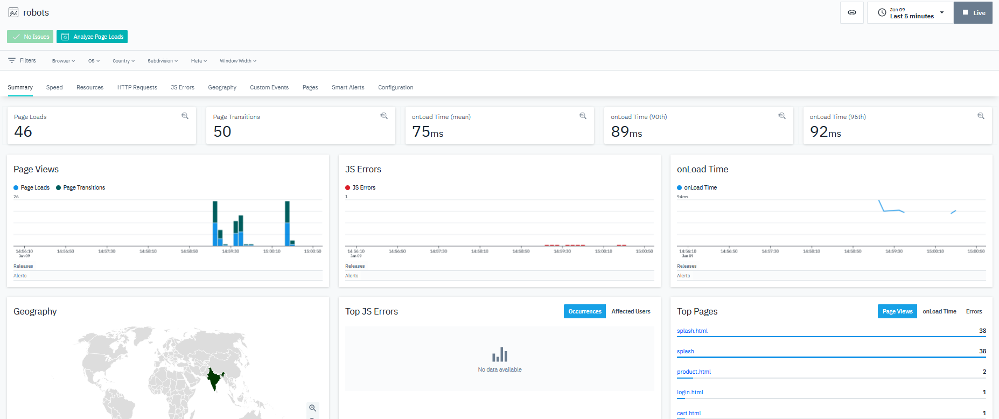

export const Title = () => (
  <span>
    Lab 6 - End User Monitoring <br />
  </span>
);
;

## Lab Overview

In this lab we will explore End-User Monitoring (EUM), or Real-User Monitoring (RUM) for the robot shop application. Instana supports website monitoring by analyzing actual browser request and loading times. It allows detailed insights into the web browsing experience of users, and deep visibility into application call paths. At the end of this lab, you will be able to analyse website monitoring for the sample application.

## Step 1: 

Click Websites & Mobile Apps from left navigation. 

Then click Add Website. 

Give a unique name for your website and click Add Website button.



Take a note of reporting url and eum key as shown below:

 

## Step 2:

SSH into the host that was provided by your instructor, and browse to the installation directory for Robot Shop 

```
cd /home/ubuntu/robot-shop

```

## Step 3:

In your terminal window type to enable end user monitoring for this application

```
vi docker-compose.yaml 
```

Uncomment and update the reporting url and eum key noted in step 1 as shown below.

 

Save the yaml file.

## Step 4:

In your terminal window type 

```
docker-compose up -d
```

Note: -d runs it in the background

Validate that Stan’s Robot Shop is up by going to:

http://(publicip):8080

## Step 5: 

Try to refresh the page http://(publicip):8080 multiple times and browse through the site.

Then go to Instana UI and click on Websites & Mobile Apps.

Search for your website and analyse various statistics.

