export const Title = () => (
  
    Lab 7 - Smart Alerts  
  
);
;

## Lab Overview

In this lab we will create smart alert for the robot shop application. Instana provides the ability to define alert conditions for various scenarios from within the context of application perspective.At the end of this lab, you will be able to create a smart alert for calls with slow response time.

## Step 1: 

Click Applications from left navigation. 

Search for the robot shop application perspective you have created in earlier lab.

Click on the ADD SMART ALERT at the bottom right corner of the robot-shop application perspective. 

## Step 2:

At ‘Step 1: Select Alert, select ‘Slow Calls’

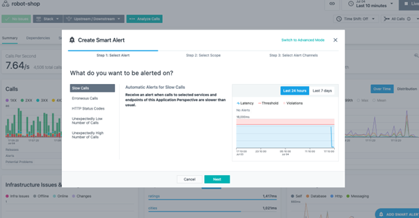 

Click Next.

At ‘Step 2: Select Scope’, robot-shop (your application perspective) is pre-selected.

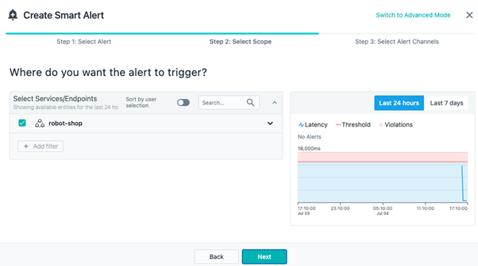 

Click Next. 

In ‘Step 3: Alert Channels’, it asks to select an alert channel. We do not have any alert channels defined so we will just leave it blank. However you can create and specify an alert channel.

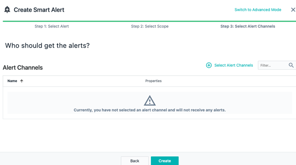 

Click Create.

## Step 3:

Go to ‘Smart Alerts’ tab in ‘robot-shop’ application perspective. You can enable/disable this alert any time just by using the pause/play button shown next to the alert.

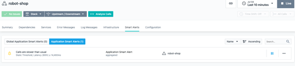 

## Step 4:

By default this alert level is ‘warning’. Let us change this alert level to critical and create an incident in this scenario. 

Click on the three dots next to pause button and click on ‘Edit’.

Click on ‘Properties’ and change alert level to critical and enable ‘Triggers Incident’. 

Also update the description to have value 200 ms.

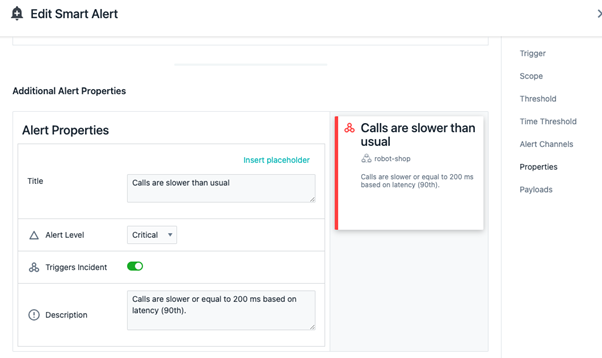 

We want to specify the threshold value for condition violation. Let us define it as if 200 ms for 90th percentile. 

Click on ‘Threshold’ and change the values as shown.

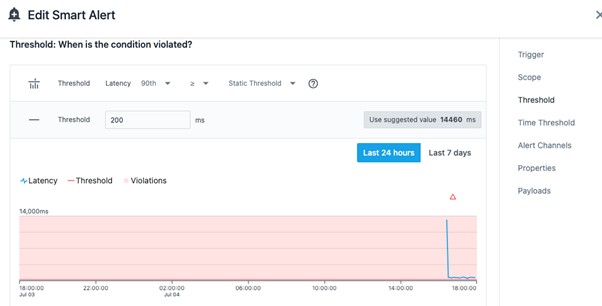

We also want to define time threshold i.e. when do you want to be alerted. Lets us define as 5 minutes and number of consecutive occurrences as 3. Click on ‘Time Threshold’ and update the values as shown in the figure. 

Click on Save.

## Step 5: 

We have defined a smart alert for robot-shop application. If the condition specified in that alert violates, an incident would be created.

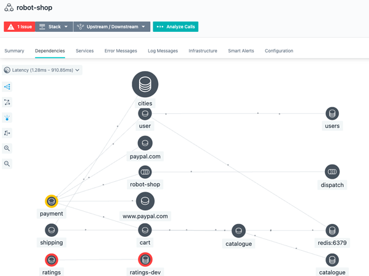

Click on the issue shown and click on ‘view 1 issue’.

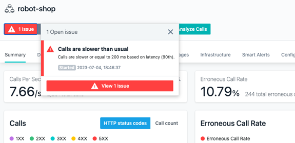

This will take you to the issue in Events view.

Go to ‘Incidents’ tab and click on the active incident. It shows the time-series view of the incident, triggering event and related events.

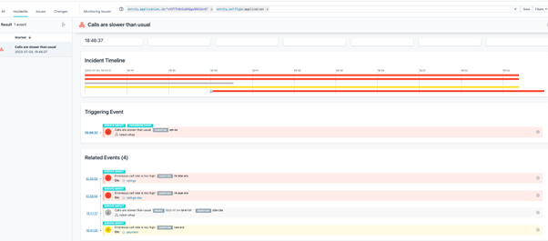

You can expand any of the events and look further details and go to analyze calls. Let us expand the triggering event.

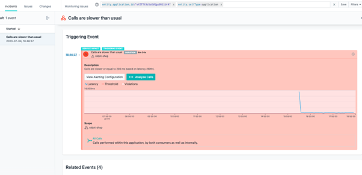

Click on ‘Analyze Calls’ for the triggering event. 
It will take you to Analytics view with filter conditions auto-applied based on the event/alert condition for the time duration when this event occurred.

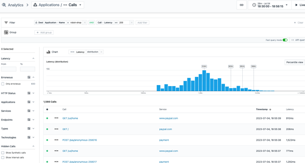

You can further analyze the calls to understand the point of slowness. 